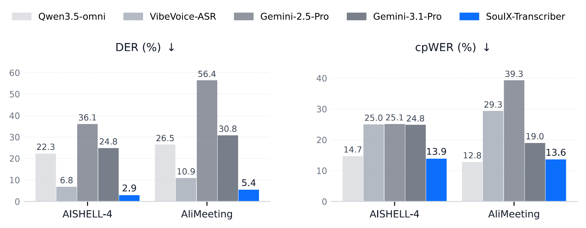
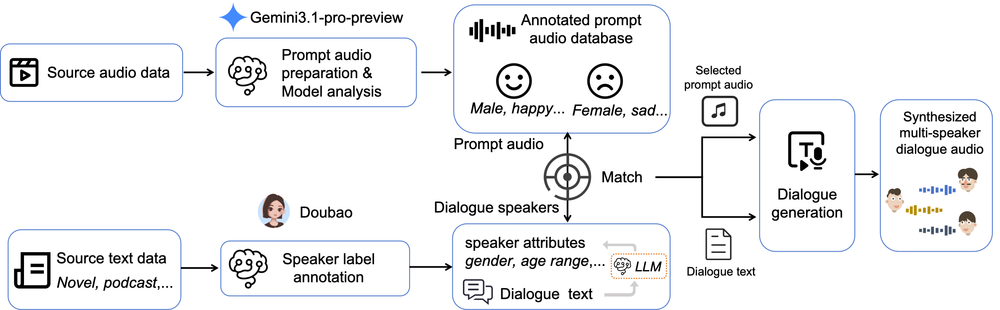

<div align="center">
  
</div>

<h1 align="center">SoulX-Transcriber: A Robust End-to-End Framework for Multi-Speaker Speech Transcription</h1>

<div align="center">

<div style="text-align: center;">
  
  
  <a href="https://soul-ailab.github.io/soulx-transcriber/">
    
  </a>
  <a href="https://arxiv.org/abs/2606.02400">
    
  </a>
  <a href="https://huggingface.co/Soul-AILab/SoulX-Transcriber">
    
  </a>
  <a href="https://github.com/Soul-AILab/SoulX-Transcriber">
    
  </a>
</div>

</div>

<div align="center">
  <h3>
    Yuhang Dai<sup>1,2</sup><sup>*</sup>, Haopeng Lin<sup>2</sup><sup>*</sup>, Zhennan Lin<sup>1</sup>, Jiale Qian<sup>2</sup>, Jun Wu<sup>2</sup>, Hao Meng<sup>2</sup>, Hanke Xie<sup>1,2</sup>, Hanlin Wen<sup>2</sup>, Chuang Ding<sup>3</sup>, Shunshun Yin<sup>2</sup>, Ming Tao<sup>2</sup>, Lei Xie<sup>1</sup>, Xinsheng Wang<sup>2†</sup>
  </h3>

  <p>
    <sup>*</sup>Equal contribution.&nbsp;&nbsp;
    <sup>†</sup>Corresponding author
  </p>

  <p>
    <sup>1</sup>Audio, Speech and Language Processing Group (ASLP@NPU), Northwestern Polytechnical University, Xi’an, China<br>
    <sup>2</sup>Soul AI Lab, China<br>
    <sup>3</sup>Moonstep AI, China<br>
  </p>
</div>


## 🎬 Demo Video

<div align="center">

<https://github.com/user-attachments/assets/161a4426-e003-4526-9e8b-0276bdfdfccd>

</div>

Please visit our  ✨[demopage](https://soul-ailab.github.io/soulx-transcriber/)✨ for more demos.
<!-- <div align="center">
  <video src="https://github.com/user-attachments/assets/9a57a227-9ac9-4bfb-961f-39df8f93b680" controls width="80%"></video>
</div> -->

## 🏆 SoulX-Transcriber performance Overview
<div align="center">
  
</div>


## 📖 Introduction

SoulX-Transcriber is a unified end-to-end large audio language model for **multi-speaker diarization and recognition** in multi-speaker dialogue scenarios. Rather than relying on a cascaded pipeline, the model directly learns speaker attribution, timestamped segmentation, and transcription in a single framework, producing coherent speaker-consistent transcripts for overlapping and fast-turn conversations. 


## 🌟 Highlights
- **State of the art performance**. SoulX-Transcriber achieves superior performance on the AISHELL-4 and AliMeeting benchmarks via a unified diarization and recognition framework, which directly produces structured outputs consisting of timestamps, speaker labels, and transcripts.
- **Speaker-aware multi-stage training**. Speaker-aware multi-task Continues Pre-Training plus Supervised Fine-tuned strengthens speaker representation and robustness to  conversations, mitigating same-gender confusion, overlap, and boundary errors.
- **A more natural and authentic approach to dialogue generation**. We propose a speaker characteristics-driven audio matching pipeline that automatically selects the most suitable reference audio for each utterance, producing more natural, context-aligned simulated dialogues.


## 📊 Results

### Utterance-level Evaluation on open-source datasets


<div style="overflow-x: auto;">
<table style="white-space: nowrap;">
  <thead>
    <tr>
      <th rowspan="2">Model</th>
      <th colspan="4" style="text-align:center;">AISHELL-4</th>
      <th colspan="4" style="text-align:center;">Alimeeting</th>
      <th colspan="4" style="text-align:center;">AMI-SDM</th>
    </tr>
    <tr>
      <th>DER↓</th><th>WER↓</th><th>cpWER↓</th><th>∆cp↓</th>
      <th>DER↓</th><th>WER↓</th><th>cpWER↓</th><th>∆cp↓</th>
      <th>DER↓</th><th>WER↓</th><th>cpWER↓</th><th>∆cp↓</th>
    </tr>
  </thead>
  <tbody>
    <tr>
      <td>VibeVoice-ASR</td>
      <td>6.77</td><td>21.40</td><td>24.99</td><td>3.59</td>
      <td>10.92</td><td>27.40</td><td>29.33</td><td>1.93</td>
      <td>13.43</td><td>24.65</td><td>28.82</td><td>4.17</td>
    </tr>
    <tr>
      <td>Gemini-2.5-Pro†</td>
      <td>36.07</td><td>19.81</td><td>25.11</td><td>5.30</td>
      <td>56.39</td><td>30.16</td><td>39.29</td><td>9.13</td>
      <td>50.28</td><td>31.66</td><td>39.98</td><td>8.32</td>
    </tr>
    <tr>
      <td>Gemini-3.1-pro-preview†</td>
      <td>24.84</td><td>24.86</td><td>24.81</td><td>-0.05</td>
      <td>30.76</td><td>18.82</td><td>18.99</td><td>0.17</td>
      <td>40.40</td><td>30.82</td><td>32.97</td><td>2.15</td>
    </tr>
    <tr>
      <td>Qwen3.5-omni†</td>
      <td>22.33</td><td>15.13</td><td>14.71</td><td><b>-0.42</b></td>
      <td>26.46</td><td><b>12.44</b></td><td><b>12.79</b></td><td>0.35</td>
      <td>30.05</td><td>28.57</td><td>33.46</td><td>4.89</td>
    </tr>
    <tr>
      <td><b>SoulX-Transcriber</b></td>
      <td><b>2.89</b></td><td><b>14.16</b></td><td><b>13.90</b></td><td>-0.26</td>
      <td><b>5.39</b></td><td><b>13.07</b></td><td>13.61</td><td><b>0.54</b></td>
      <td><b>11.67</b></td><td><u>25.55</u></td><td>32.78<td>7.23</td>
    </tr>
  </tbody>
</table>
</div>

###  Segmented Evaluation (5 minutes segments)

<div style="overflow-x: auto;">
<table style="white-space: nowrap;">
  <thead>
    <tr>
      <th rowspan="2">Model</th>
      <th colspan="4" style="text-align:center;">Alimeeting</th>
      <th colspan="4" style="text-align:center;">AISHELL-4</th>
    </tr>
    <tr>
      <th>DER↓</th><th>CER↓</th><th>cpCER↓</th><th>∆cp↓</th>
      <th>DER↓</th><th>CER↓</th><th>cpCER↓</th><th>∆cp↓</th>
    </tr>
  </thead>
  <tbody>
    <tr><td colspan="7"><b>End-to-End Baselines</b></td></tr>
    <tr>
      <td>VibeVoice-ASR</td>
      <td><u>18.00</u></td><td>29.72</td><td>31.94</td><td>2.22</td>
      <td><u>9.17</u></td><td>19.54</td><td>22.95</td><td>3.41</td>
    </tr>
    <tr>
      <td>Gemini-2.5-Pro†</td>
      <td>58.14</td><td>31.69</td><td>42.22</td><td>10.53</td>
      <td>40.87</td><td>20.26</td><td>26.31</td><td>6.05</td>
    </tr>
    <tr>
      <td>Gemini-3.1-pro-preview†</td>
      <td>38.75</td><td>26.75</td><td>32.84</td><td>6.09</td>
      <td>22.03</td><td>22.75</td><td>27.43</td><td>4.68</td>
    </tr>
    <tr>
      <td>Qwen3-omni-30B-Instruct</td>
      <td>38.36</td><td>25.28</td><td>37.54</td><td>12.26</td>
      <td>34.71</td><td><u>15.95</u></td><td>23.63</td><td>7.68</td>
    </tr>
    <tr><td colspan="9"><b>Ours</b></td></tr>
    <tr>
      <td><b>SoulX-Transcriber</b></td>
      <td><b>4.40</b></td><td><b>10.34</b></td><td><b>11.58</b></td><td><b>1.24</b></td>
      <td><b>6.12</b></td><td><b>12.87</b></td><td><b>15.45</b></td><td><u>2.58</u></td>
    </tr>
  </tbody>
</table>
</div>

### Internal Multi-domain Evaluation
<div style="overflow-x: auto;">
<table style="white-space: nowrap;">
  <thead>
    <tr>
      <th rowspan="2">Model</th>
      <th colspan="4" style="text-align:center;">Social conversation</th>
      <th colspan="4" style="text-align:center;">Drama</th>
      <th colspan="4" style="text-align:center;">Podcast</th>
    </tr>
    <tr>
      <th>DER↓</th><th>WER↓</th><th>cpWER↓</th><th>∆cp↓</th>
      <th>DER↓</th><th>WER↓</th><th>cpWER↓</th><th>∆cp↓</th>
      <th>DER↓</th><th>WER↓</th><th>cpWER↓</th><th>∆cp↓</th>
    </tr>
  </thead>
  <tbody>
    <tr>
      <td>VibeVoice-ASR</td>
      <td>2.76</td><td>30.34</td><td>31.77</td><td>1.43</td>
      <td>27.78</td><td>21.86</td><td>45.87</td><td>24.01</td>
      <td><b>14.7</b></td><td>8.88</td><td><b>14.58</b></td><td>5.7</td>
    </tr>
    <tr>
      <td>Gemini-3.1-pro-preview†</td>
      <td>38.69</td><td>29.14</td><td>36.72</td><td>7.58</td>
      <td>34.87</td><td>10.01</td><td>21.03</td><td>11.02</td>
      <td>24.56</td><td>23.89</td><td>27.21</td><td><b>3.32</b></td>
    </tr>
    <tr>
      <td><b>SoulX-Transcriber</b></td>
      <td><b>1.32</b></td><td><b>6.73</b></td><td><b>7.31</b></td><td><b>0.58</b></td>
      <td><b>23.56</b></td><td><b>5.17</b></td><td><b>20.58</b></td><td><b>15.41</b></td>
      <td>21.15</td><td><b>7.5</b></td><td>19.37</td><td>11.87</td>
    </tr>
  </tbody>
</table>
</div>

† Closed-source model.

## 🧪 Multi-speaker Dialogue Simulation Pipeline

To improve out-of-domain generalization, we build an **agent-based multi-speaker dialogue simulation pipeline** with a **speaker-aware prompt audio matching** mechanism. Given a target dialogue text, the system analyzes speaker tags, selects the most suitable **reference audio** for each speaker using **multi-dimensional speaker representations**, and synthesizes context-consistent multi-turn dialogue audio.

**Workflow:** building dialogue text database → building reference audio database → target text analysis → reference audio matching → dialogue audio generation. Detailed information is shown on the figure below.
<div align="center">
  
</div>

- **Dialogue text database.** We collect multi-speaker dialogue texts from Chinese/English podcasts and novels. An LLM annotates speaker tags and controls the number of speakers; we keep segments with **3–8 speakers** to ensure natural, coherent dialogue context.

- **Dialogue context analysis:** We use **Qwen3-8B** as the LLM brain for speaker-tag and context analysis, and **SoulX-Podcast & MOSS-TTSD** for long-form, multi-speaker multi-turn TTS synthesis.

- **Reference audio database.** We run VAD on long-form drama audio, cut it into **3–10s** clips, and filter by **UTMOS** and **SNR** to ensure quality. Each clip is annotated by **Gemini-3.1-pro-preview** with multi-dimensional speaker attributes (e.g., gender/age/emotion/speech rate/pitch/timbre/style/tone/role state). We embed each attribute using **bge-m3** and stack them into a per-clip feature matrix, forming an embedding index for retrieval.

- **Best reference–audio matching.** Given a target dialogue with speaker tags, an LLM analyzes each speaker’s attributes and builds the same multi-dimensional embedding representation. We compute similarity against all reference clips, apply a weighted score across attribute dimensions, and retrieve **top-k (k=3)** candidates per speaker. A final selection enforces diversity (different source speakers) and **UTMOS consistency (|Δ| ≤ 0.5)** to produce the best reference audio set for synthesis.


## Installation

### Environment Setup

```bash
git clone https://github.com/Soul-AILab/SoulX-Transcriber.git
cd SoulX-Transcriber

conda create -n soulx_transcriber python=3.12 -y
conda activate soulx_transcriber
```

Install MS-Swift and dependencies:

```bash
pip install ms-swift
```

## Model Download

We provide the pre-trained model weights on Hugging Face and modelscope. You can download the model based on your requirements:

| Model Version | Description | Language | Download |
| :--- | :--- | :---: | :---: |
| **SoulX-Transcriber** | Full version of SoulX-Transcriber | ZH/EN | [🤗 Hugging Face](https://huggingface.co/Soul-AILab/SoulX-Transcriber) |
| **SoulX-Transcriber** | Full version of SoulX-Transcriber | ZH/EN | [ ModelScope](https://modelscope.cn/models/Soul-AILab/SoulX-Transcriber) |

## Training & Fine-tuning
SoulX-Transcriber shares the same architecture with Qwen3-Omni-30BA3B-Instruct. We recommend users conduct continued pre-training and fine-tuning for this model via the [ms-swift](https://github.com/modelscope/ms-swift) toolkit.
## Inference

### vLLM-omni

SoulX-Transcriber is built on top of [Qwen3-Omni-30B-A3B-Instruct](https://huggingface.co/Qwen/Qwen3-Omni-30B-A3B-Instruct). We recommend using vllm-omni for inference..

```bash
cd your_env_path/
# install uv：
curl -LsSf https://astral.sh/uv/install.sh | sh
# create new uv environment（using aliyun mirror）
uv venv vllm_omni --python 3.12 --seed --index-url https://mirrors.aliyun.com/pypi/simple/
# activate uv environment
source vllm_omni/bin/activate
# install vllm：
uv pip install vllm --torch-backend=auto --index-url https://mirrors.aliyun.com/pypi/simple/
# install vllm-omni:
uv pip install vllm-omni --index-url https://mirrors.aliyun.com/pypi/simple/
# install gradio (Optional)：
uv pip install 'vllm-omni[demo]' --index-url https://mirrors.aliyun.com/pypi/simple/
# If you meet an "Undefined symbol" error while using VLLM_USE_PRECOMPILED=1, please use "pip install -e . -v" to build from source.
git clone https://github.com/vllm-project/vllm-omni.git
cd vllm-omni
uv pip install -e . --index-url https://mirrors.aliyun.com/pypi/simple/
```
> For more details on compiling vLLM from source, refer to the [vLLM official documentation](https://docs.vllm.ai/en/latest/getting_started/installation/gpu.html#set-up-using-python-only-build-without-compilation).

### Infer single wav file


```bash
# stage1: download pretrained model
# stage2: inference
source your_env_path/vllm_omni/bin/activate  # source the env
bash ./inference.sh
```


## 🙏 Acknowledgements

Special thanks to the following open-source projects:

- [Qwen3-omni](https://github.com/QwenLM/Qwen3-Omni)
- [Qwen3](https://github.com/QwenLM/Qwen3)
- [SoulX-Podcast](https://github.com/Soul-AILab/SoulX-Podcast)
- [MOSS-TTSD](https://github.com/OpenMOSS/MOSS-TTSD)
- [FireRedASR](https://github.com/FireRedTeam/FireRedASR)
- [Paraformer](https://modelscope.cn/models/iic/speech_seaco_paraformer_large_asr_nat-zh-cn-16k-common-vocab8404-pytorch)
- [utmos](https://github.com/fakerybakery/utmos)


## Citation

If you find this work useful, please cite:

```bibtex
@misc{dai2026soulxtranscriber,
      title={SoulX-Transcriber: A Robust End-to-End Framework for Multi-Speaker Speech Transcription}, 
      author={Yuhang Dai and Haopeng Lin and Zhennan Lin and Jiale Qian and Jun Wu and Hanke Xie and Hao Meng and Hanlin Wen and Chuang Ding and Shunshun Yin and Ming Tao and Lei Xie and Xinsheng Wang},
      year={2026},
      eprint={2606.02400},
      archivePrefix={arXiv},
      primaryClass={eess.AS},
      url={https://arxiv.org/abs/2606.02400}, 
}
```

## License
We use the **Apache 2.0 License**. Researchers and developers are free to use the codes and model weights of our SoulX-Transcriber. Check the license at [LICENSE](LICENSE) for more details.
## Contact

- **Issues**: Please open a GitHub Issue for bug reports or suggestions.
- **Email**: yhdai@mail.nwpu.edu.cn, haopenglin@soulapp.cn, lxie@nwpu.edu.cn, wangxinsheng@soulapp.cn

